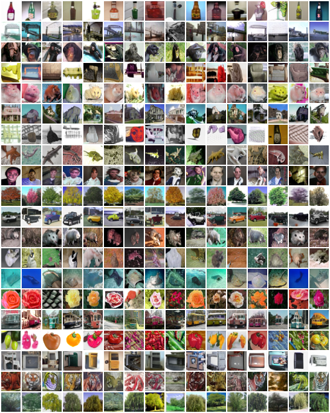

# Overcoming challenges in leveraging GANs for few-shot data augmentation

Authors: Christopher Beckham $^{\dagger}$, Issam H. Laradji, Pau Rodriguez, David Vazquez, Derek Nowrouzezahrai, Christopher Pal<br />

<sup>$^{\dagger}$ work performed during a research internship at [ServiceNow Research](https://www.servicenow.com/research/)</sup>

<p align="justify">In this paper, we explore the use of GAN-based few-shot data augmentation as a method to improve few-shot classification performance. We perform an exploration into how a GAN can be fine-tuned for such a task (one of which is in a <i>class-incremental</i> manner), as well as a rigorous empirical investigation into how well these models can perform to improve few-shot classification. We identify issues related to the difficulty of training such generative models under a purely supervised regime with very few examples, as well as issues regarding the evaluation protocols of existing works. We also find that in this regime, classification accuracy is highly sensitive to how the classes of the dataset are randomly split. Therefore, we propose a semi-supervised fine-tuning approach as a more pragmatic way forward to address these problems, and demonstrate gains in FID and precision-recall metrics as well as classification performance.</p>

## Example generated images for few-shot classes

`k` denotes the number of images per few-shot class used to fine-tune the GAN.

|        | k = 5             | k = 10           | k = 15           |
|--------|-----------------|----------------|----------------|
| EMNIST |             |             |             |
| EMNIST (semi-sup) |             |             |             |

|          | k = 5           | k = 5 (semi)
|----------|-----------------|----------------|
| Omniglot |  |   |

|          | k = 100           | k = 100 (semi)
|----------|-------------------|----------------|
| CIFAR-100 |  |   |


# Installation

## Downloading pre-trained checkpoints

After cloning the repository, download the pre-trained checkpoints. You can download `fsi-backup.tar.gz` here on [Google Drive](https://drive.google.com/file/d/1N2UUDfnDaZ9AXztO3HFZXKuPCLhe21ye/view?usp=sharing). Once you have `fsi-backup.tar.gz` downloaded, untar it in some directory of your choosing, e.g:

```
cd /somedir/checkpoints
tar -xvzf fsi-backup.tar.gz
```

## Updating paths

`env.sh` contains all the necessary environment variables that need to be defined in order for experiments to be run. In particular:
- The `$results` variable must point to whatever directory you extracted the pre-trained checkpoints to. For instance,
  if you un-tared `fsi-backup.tar.gz` into `/somedir/checkpoints`, then you should have `export results=/somedir/checkpoints`. 
- You must have the Git repository for StyleGAN2-ADA in your `$PYTHONPATH`. Simply git clone [this repo](https://github.com/NVlabs/stylegan2-ada-pytorch) somewhere and modify `$STYLEGAN2_ADA_PYTORCH` to point to this directory. `env.sh` will automatically append this to your `$PYTHONPATH`. StyleGAN2 code is only used for the CIFAR-100 experiments.
- `$SAVEDIR_BASE` is where experiment logs should be saved to. By default, it is set to inherit whatever the value of `$results` is.
- `$viz_tmp` is a directory to store visualisations. It can be used with `eval.py`.
  
When both these steps are done, source the `env.sh` file with `source env.sh`.

## Dependencies

Install the following dependencies in an environment of your choosing with `pip install`:

```
tqdm
torch==1.7.1
torchvision==0.8.2
pytorch-fid==0.2.1
Pillow==8.3.2
pandas==1.4.2
prdc==0.2
```

If you are working with Docker, the specific base image used was `pytorch/pytorch:1.7.1-cuda11.0-cudnn8-devel`.

`all_requirements.txt` are all the packages that exist in my internal development environment, but I do not recommend installing from this since there will be a lot of 'dirty' dependencies not related to this project specifically. Use it as a last resort if you wish. Otherwise, if there is a missing dependency please post a Github issue so I can rectify it.

# Training

## Reproducing an experiment

`env.sh` specifies an environment variable for each experiment. If we look at this file, we can see that each experiment's path is
specified by a particular environment variable. For instance:

- `EMNIST_STAGE2A_S0` corresponds to the GAN pre-training experiment
for seed=0;
- `EMNIST_STAGE2B_K5_S0` is the GAN fine-tuning experiment for `seed=0` when `k=5`; 
- and the corresponding semi-supervised experiment is called `EMNIST_STAGE2B_K5_SEMI_ALPHA_S0`.

Make sure you `source env.sh` prior to the following subsections because they depend on these variables.

### Classifier experiments

For classifier pre-training:

If we want to reproduce the experiment for `EMNIST_PRETRAINED_CLS_S0` (EMNIST dataset seed 0), run the example script `bash exps/example-stage1.sh`:

```
python launch.py \
--tl=trainval_clf.py \
--json_file=$EMNIST_PRETRAINED_CLS_S0/exp_dict.json \
--savedir=/tmp/emnist-stage1-seed0 \
-d /mnt/public/datasets
```

Basically:
- `json_file` points to the exact experiment config that was used to train `EMNIST_PRETRAINED_CLS_S0`.
- `tl` is the train launcher, in this case `trainval_clf.py` is what we use to do classifier pre-training.
- `savedir` specifies the directory where the experiment should be saved.
- `-d` specifies where the data should be located, which in this case is where the EMNIST dataset will be downloaded to.

### GAN pre-training

If we want to reproduce the experiment for `EMNIST_STAGE2A_S0` (EMNIST dataset seed 0), run the example script `bash exps/example-stage2a.sh`:

```
python launch.py \
--json_file=$EMNIST_STAGE2A_S0/exp_dict.json \
--tl=trainval.py \
--savedir=/tmp/emnist-stage2a-seed0 \
-d /mnt/public/datasets
```

Basically:
- `json_file` points to the exact experiment config that was used to train `EMNIST_STAGE2A_S0` (`STAGE2A` = GAN pre-training).
- `tl` is the train launcher, in this case `trainval.py` is what we use to do GAN pre-training or GAN finetuning (the latter is coded as `STAGE2B`).

### GAN fine-tuning

The GAN fine-tuning `exp_dict.json` should be more or less identical to that of the pre-trained GAN, but with these extra arguments:

- `model.g_finetune_mode`: G finetuning mode ('embed', 'linear', or 'all')
- `model.d_finetune_mode`: D finetuning mode ('embed', 'linear', or 'all')
- `finetune`: should be set to `true`. This will swap the training set out for the support set, as well as apply the finetuning modes. Note that if `g_finetune_mode` or `d_finetune_mode` are set in a pre-trained GAN experiment these will have no effect. 
- `pretrained`: path to the pth file of the pre-trained GAN, e.g. `<experiment name>/<experiment id>/model.fid.pth`.
- `dataset.pad_length`: this simply duplicates the dataset `pad_length` times to reduce the overhead of constantly creating new data loaders every time an epoch completes (which would be very quickly, since we are training on the support set)

An example script is `exps/example-stage2b.sh`:

```
python launch.py \
--json_file=$EMNIST_STAGE2B_K5_S1/exp_dict.json        `#read exp dict from original experiment` \
--tl=trainval.py                                       `#trainval to launch GAN pre-training experiments` \
--savedir=/tmp/emnist-stage2b-k5-seed1                 `#save experiment here` \
-d /mnt/public/datasets                                `#datasets will be downloaded here`
```

Note that this requires you to modify `$EMNIST_STAGE2B_K5_S0/exp_dict.json` and replace its `pretrained` field with `$EMNIST_STAGE2A_S0/model.fid.pth`. This is because it is currently set to be the (hardcoded) path that was used internally during development. The code will automatically perform the environment variable substitution for `$EMNIST_STAGE2A_S0` so that it is recognised internally.

## Designing your own experiment

Each training script (`trainval.py`, `trainval_clf.py`) have global variables called `DEFAULTS` which detail... TODO

TODO explain args and json file.

## Exporting metrics for pre-trained checkpoints

Note that each pre-trained experiment directory contains a `score_list.pkl` file, which is the raw training metrics file for when we trained that experiment internally. These can be easily viewed with the following code:

```
import pickle
import os
pkl_file = os.environ['EMNIST_STAGE2A_S0'] + "/score_list.pkl"
pkl = pickle.load(open(pkl_file, "rb"))
pandas_df = pd.DataFrame(pkl)
```

Alternatively, one can use `pkl2csv.py` to convert it to csv:

```
python pkl2csv.py $EMNIST_STAGE2A_S0/score_list.pkl score_list.csv
```

# Evaluation

Each experiment contains usually two `.pth` checkpoint files. `model.pth` is the checkpoint corresponding to the very last epoch the experiment was trained for, while `model.<metric>.pth` is the checkpoint corresponding to the best metric. For instance, for `*STAGE2A` (GAN pre-training) experiments this is `fid`, so you will see `model.fid.pth`. For `*STAGEB` this is usually `model.valid_fid.pth`.

To output generated images:

```
python eval.py \
--experiment=$EMNIST_STAGE2A_S0 \
--model=model.fid.pth \
--savedir=$viz_tmp
```

For instance, if `--savedir=/tmp` then it will output images to this folder:

```
/tmp/<experiment name>/<experiment id>/images
```

This will produce six diagnostic images, three per `{train, dev}` split. (In the code, `dev` is used to internally refer to the support set, and it should go without saying that the `dev_*.png` images will look like gibberish if one is using a `_STAGE2A` experiment, because fine-tuning has not yet been performed.)

| | image | description
|-|-------|------------|
| `{split}_class_interp.png` ||Each column uses a fixed `z` but interpolates `embed(y)` via `alpha*embed(y1) + (1-alpha)*embed(y2)`, where the top-most images have labels `y1`, the bottom-most images have `y2`, and `alpha` is shown as blue text for each row.
| `{split}_interp_xover.png` | |Each column has an associated `(x1,y1)` and `(x2,y2)`, as well as two randomly sampled noise vectors `z1` and `z2`. First two rows are `x1` and `x2`, next rows are `G(y1,z1)`, `G(y1,z2)`, `G(y1,0)`, `G(y2,z1)`, and `G(y2,z2)`, respectively. If the GAN has been trained 'right', then samples should be class consistent with their corresponding y's and the z's should reflect particular styles.
| `{split}_generated.png` | |This image is a `k * n` image matrix where `k` denotes the number of classes (in whatever split is being visualised) and `n` is the number of randomly generated images for that class.

# Miscellaneous

## Exporting datasets

If you would prefer to simply use the exact same dataset splits we used without running our code, this is also possible. The following [Google Drive link](https://drive.google.com/drive/folders/1cRcgqHosBOU9jESul0C4fcOuSRUzXnYa?usp=sharing)  provides access to each dataset used as well as their splits. Each pkl has the naming convention `{dataset}-s{seed}-{res}px-k{kshot}-{split}.pkl`. For example, these files correspond to EMNIST with `seed=0`, 32px resolution, and `k_shot=5`:

```
emnist_fs-s0-32px-k5-train.pkl
emnist_fs-s0-32px-k5-supports.pkl
emnist_fs-s0-32px-k5-valid.pkl
emnist_fs-s0-32px-k5-test.pkl      
```
